```mermaid
graph TD
    ROOT["🏢 Skills HQ"]:::root --> DEV["👨‍💻 Developers"]:::dept
    ROOT --> DES["🎨 Designers"]:::dept

    DEV --> SP["⚡ Superpowers"]:::skill
    DEV --> C7["📚 Context7"]:::skill
    DEV --> SC["🛠️ Skill Creator"]:::skill
    DEV --> MB["🔧 MCP Builder"]:::skill
    DEV --> WT["🧪 Webapp Testing"]:::skill
    DEV --> CM["🧠 Claude-Mem"]:::skill

    DES --> UX["✨ UI UX Pro Max"]:::skill
    DES --> TS["👁️ Taste"]:::skill
    DES --> FD["🖼️ Frontend Design"]:::skill
    DES --> TR["💫 Transitions"]:::skill
    DES --> WA["🌐 Web Artifacts"]:::skill
    DES --> BG["📋 Brand Guidelines"]:::skill

    click SP href "https://github.com/obra/superpowers" _blank
    click C7 href "https://github.com/upstash/context7" _blank
    click SC href "https://github.com/anthropics/skills" _blank
    click MB href "https://github.com/anthropics/skills" _blank
    click WT href "https://github.com/anthropics/skills" _blank
    click CM href "https://github.com/thedotmack/claude-mem" _blank
    click UX href "https://github.com/nextlevelbuilder/ui-ux-pro-max-skill" _blank
    click TS href "https://github.com/Leonxlnx/taste-skill" _blank
    click FD href "https://github.com/Leonxlnx/taste-skill" _blank
    click TR href "https://github.com/Jakubantalik/transitions.dev" _blank
    click WA href "https://github.com/anthropics/skills" _blank
    click BG href "https://github.com/anthropics/skills" _blank

    classDef root fill:#1a1a2e,stroke:#e94560,color:#fff,font-weight:bold
    classDef dept fill:#16213e,stroke:#0f3460,color:#e94560,font-weight:bold
    classDef skill fill:#0f3460,stroke:#533483,color:#fff
```

# 🏢 Skills Org Chart

*A curated library of Claude Code skills, organised by department.*

---

---

## 👨‍💻 Developers

| Skill | Source |
|-------|--------|
| ⚡ [**Superpowers**](https://github.com/obra/superpowers) | obra/superpowers |
| 📚 [**Context7**](https://github.com/upstash/context7) | upstash/context7 |
| 🛠️ [**Skill Creator**](https://github.com/anthropics/skills) | anthropics/skills |
| 🔧 [**MCP Builder**](https://github.com/anthropics/skills) | anthropics/skills |
| 🧪 [**Webapp Testing**](https://github.com/anthropics/skills) | anthropics/skills |
| 🧠 [**Claude-Mem**](https://github.com/thedotmack/claude-mem) | thedotmack/claude-mem |

---

## 🎨 Designers

| Skill | Source |
|-------|--------|
| ✨ [**UI UX Pro Max**](https://github.com/nextlevelbuilder/ui-ux-pro-max-skill) | nextlevelbuilder/ui-ux-pro-max-skill |
| 👁️ [**Taste**](https://github.com/Leonxlnx/taste-skill) | Leonxlnx/taste-skill |
| 🖼️ [**Frontend Design**](https://github.com/Leonxlnx/taste-skill) | Leonxlnx/taste-skill |
| 💫 [**Transitions**](https://github.com/Jakubantalik/transitions.dev) | Jakubantalik/transitions.dev |
| 🌐 [**Web Artifacts**](https://github.com/anthropics/skills) | anthropics/skills |
| 📋 [**Brand Guidelines**](https://github.com/anthropics/skills) | anthropics/skills |

---

Built with Claude Code

