```mermaid
graph TD
    ROOT["🏢 Skills HQ"]:::root --> DEV["👨‍💻 Developers"]:::dept
    ROOT --> DES["🎨 Designers"]:::dept
    ROOT --> ENG["🐍 Engineering"]:::dept
    ROOT --> DB["🗄️ Databases"]:::dept
    ROOT --> AI["🤖 AI & Automation"]:::dept

    DEV --> SP["⚡ Superpowers"]:::skill
    DEV --> C7["📚 Context7"]:::skill
    DEV --> SC["🛠️ Skill Creator"]:::skill
    DEV --> MB["🔧 MCP Builder"]:::skill
    DEV --> WT["🧪 Webapp Testing"]:::skill
    DEV --> CM["🧠 Claude-Mem"]:::skill

    DES --> UX["✨ UI UX Pro Max"]:::skill
    DES --> TS["👁️ Taste"]:::skill
    DES --> FD["🖼️ Frontend Design"]:::skill
    DES --> TR["💫 Transitions"]:::skill
    DES --> WA["🌐 Web Artifacts"]:::skill
    DES --> BG["📋 Brand Guidelines"]:::skill

    ENG --> KP["🧠 Karpathy Rules"]:::skill
    ENG --> SB["📦 Agent Sandbox"]:::skill
    ENG --> AC["⭐ Awesome Claude Code"]:::skill
    ENG --> CS["🗂️ Claude Skills 345"]:::skill

    AI --> N8N["🔄 n8n Skills"]:::skill
    AI --> WF["🧩 Claude Workflows"]:::skill
    AI --> TK["🚀 Claude Toolkit"]:::skill
    AI --> SA["🤖 Septim Agents"]:::skill
    AI --> UG["🌐 Ultimate Guide"]:::skill
    AI --> WH["📡 Webhook Skills"]:::skill
    AI --> SN["🔍 Sentry for AI"]:::skill

    DB --> DD["🗄️ Database Designer"]:::skill
    DB --> SQ["🔍 SQL Pro"]:::skill
    DB --> PG["🐘 PostgreSQL Pro"]:::skill
    DB --> DE["📊 Senior Data Engineer"]:::skill
    DB --> PSG["⚡ Postgres Skills Generator"]:::skill
    DB --> PGMCP["🔌 PostgreSQL MCP"]:::skill
    DB --> SUP["☁️ Supabase MCP"]:::skill
    DB --> CDT["🛠️ Claude Database Tools"]:::skill

    click SP href "https://github.com/obra/superpowers" _blank
    click C7 href "https://github.com/upstash/context7" _blank
    click SC href "https://github.com/anthropics/skills" _blank
    click MB href "https://github.com/anthropics/skills" _blank
    click WT href "https://github.com/anthropics/skills" _blank
    click CM href "https://github.com/thedotmack/claude-mem" _blank
    click UX href "https://github.com/nextlevelbuilder/ui-ux-pro-max-skill" _blank
    click TS href "https://github.com/Leonxlnx/taste-skill" _blank
    click FD href "https://github.com/Leonxlnx/taste-skill" _blank
    click TR href "https://github.com/Jakubantalik/transitions.dev" _blank
    click WA href "https://github.com/anthropics/skills" _blank
    click BG href "https://github.com/anthropics/skills" _blank
    click KP href "https://github.com/multica-ai/andrej-karpathy-skills" _blank
    click SB href "https://github.com/disler/agent-sandbox-skill" _blank
    click AC href "https://github.com/hesreallyhim/awesome-claude-code" _blank
    click CS href "https://github.com/alirezarezvani/claude-skills" _blank
    click N8N href "https://github.com/czlonkowski/n8n-skills" _blank
    click WF href "https://github.com/ithiria894/awesome-claude-code-workflows" _blank
    click TK href "https://github.com/rohitg00/awesome-claude-code-toolkit" _blank
    click SA href "https://github.com/alirezarezvani/claude-skills" _blank
    click UG href "https://github.com/FlorianBruniaux/claude-code-ultimate-guide" _blank
    click WH href "https://github.com/anthropics/skills" _blank
    click SN href "https://github.com/anthropics/skills" _blank
    click DD href "https://github.com/alirezarezvani/claude-skills" _blank
    click SQ href "https://github.com/VoltAgent/awesome-claude-code-subagents" _blank
    click PG href "https://github.com/VoltAgent/awesome-claude-code-subagents" _blank
    click DE href "https://github.com/alirezarezvani/claude-skills" _blank
    click PSG href "https://github.com/jonfdag-dot/postgres-claude-skills-generator" _blank
    click PGMCP href "https://github.com/sgaunet/postgresql-mcp" _blank
    click SUP href "https://supabase.com/docs/guides/ai-tools/mcp" _blank
    click CDT href "https://github.com/cyronius/claude-database-tools" _blank

    classDef root fill:#1a1a2e,stroke:#e94560,color:#fff,font-weight:bold
    classDef dept fill:#16213e,stroke:#0f3460,color:#e94560,font-weight:bold
    classDef skill fill:#0f3460,stroke:#533483,color:#fff
```

# 🏢 Skills Org Chart

*A curated library of Claude Code skills, organised by department.*

---

---

## 👨‍💻 Developers

| Skill | Source |
|-------|--------|
| ⚡ [**Superpowers**](https://github.com/obra/superpowers) | obra/superpowers |
| 📚 [**Context7**](https://github.com/upstash/context7) | upstash/context7 |
| 🛠️ [**Skill Creator**](https://github.com/anthropics/skills) | anthropics/skills |
| 🔧 [**MCP Builder**](https://github.com/anthropics/skills) | anthropics/skills |
| 🧪 [**Webapp Testing**](https://github.com/anthropics/skills) | anthropics/skills |
| 🧠 [**Claude-Mem**](https://github.com/thedotmack/claude-mem) | thedotmack/claude-mem |

---

## 🎨 Designers

| Skill | Source |
|-------|--------|
| ✨ [**UI UX Pro Max**](https://github.com/nextlevelbuilder/ui-ux-pro-max-skill) | nextlevelbuilder/ui-ux-pro-max-skill |
| 👁️ [**Taste**](https://github.com/Leonxlnx/taste-skill) | Leonxlnx/taste-skill |
| 🖼️ [**Frontend Design**](https://github.com/Leonxlnx/taste-skill) | Leonxlnx/taste-skill |
| 💫 [**Transitions**](https://github.com/Jakubantalik/transitions.dev) | Jakubantalik/transitions.dev |
| 🌐 [**Web Artifacts**](https://github.com/anthropics/skills) | anthropics/skills |
| 📋 [**Brand Guidelines**](https://github.com/anthropics/skills) | anthropics/skills |

---

## 🐍 Engineering

| Skill | Source |
|-------|--------|
| 🧠 [**Karpathy Rules**](https://github.com/multica-ai/andrej-karpathy-skills) | multica-ai/andrej-karpathy-skills |
| 📦 [**Agent Sandbox**](https://github.com/disler/agent-sandbox-skill) | disler/agent-sandbox-skill |
| ⭐ [**Awesome Claude Code**](https://github.com/hesreallyhim/awesome-claude-code) | hesreallyhim/awesome-claude-code |
| 🗂️ [**Claude Skills 345**](https://github.com/alirezarezvani/claude-skills) | alirezarezvani/claude-skills |

---

## 🤖 AI & Automation

| Skill | Source |
|-------|--------|
| 🔄 [**n8n Skills**](https://github.com/czlonkowski/n8n-skills) | czlonkowski/n8n-skills |
| 🧩 [**Claude Code Workflows**](https://github.com/ithiria894/awesome-claude-code-workflows) | ithiria894/awesome-claude-code-workflows |
| 🚀 [**Claude Code Toolkit**](https://github.com/rohitg00/awesome-claude-code-toolkit) | rohitg00/awesome-claude-code-toolkit |
| 🤖 [**Septim Agents Pack**](https://github.com/alirezarezvani/claude-skills) | alirezarezvani/claude-skills |
| 🌐 [**Claude Code Ultimate Guide**](https://github.com/FlorianBruniaux/claude-code-ultimate-guide) | FlorianBruniaux/claude-code-ultimate-guide |
| 📡 [**Webhook Skills**](https://github.com/anthropics/skills) | anthropics/skills |
| 🔍 [**Sentry for AI**](https://github.com/anthropics/skills) | anthropics/skills |

---

## 🗄️ Databases

| Skill | Source |
|-------|--------|
| 🗄️ [**Database Designer**](https://github.com/alirezarezvani/claude-skills) | alirezarezvani/claude-skills |
| 🔍 [**SQL Pro**](https://github.com/VoltAgent/awesome-claude-code-subagents) | VoltAgent/awesome-claude-code-subagents |
| 🐘 [**PostgreSQL Pro**](https://github.com/VoltAgent/awesome-claude-code-subagents) | VoltAgent/awesome-claude-code-subagents |
| 📊 [**Senior Data Engineer**](https://github.com/alirezarezvani/claude-skills) | alirezarezvani/claude-skills |
| ⚡ [**Postgres Skills Generator**](https://github.com/jonfdag-dot/postgres-claude-skills-generator) | jonfdag-dot/postgres-claude-skills-generator |
| 🔌 [**PostgreSQL MCP**](https://github.com/sgaunet/postgresql-mcp) | sgaunet/postgresql-mcp |
| ☁️ [**Supabase MCP**](https://supabase.com/docs/guides/ai-tools/mcp) | official Supabase |
| 🛠️ [**Claude Database Tools**](https://github.com/cyronius/claude-database-tools) | cyronius/claude-database-tools |

---

Built with Claude Code

